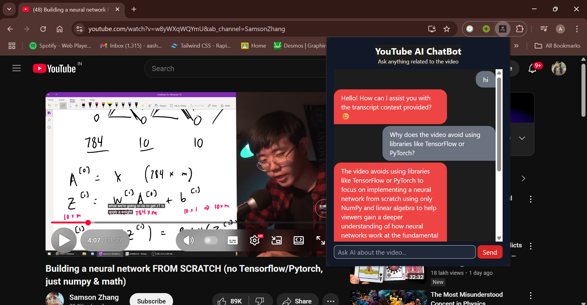

## 📸 Screenshots

# 💬 AI Youtube Chatbot Chrome Extension 🤖

Chat with an AI assistant about any YouTube video — get instant answers, summaries, and insights based on the video content.

## 🚀 Features

### 🎯 Works on YouTube Only  
The extension activates **only on YouTube video pages**, ensuring relevant usage and accurate responses.

### 🧠 AI-Powered Answers  
Your queries are processed by a backend AI system that **retrieves, understands**, and **responds** using the video’s transcript.

### 🧾 Automatic Transcript Handling  
The extension automatically **fetches and chunks the video transcript**, so you don’t have to do anything extra.

### 💬 Clean Chat UI  
A minimal, responsive UI with **chat bubbles** for user and AI messages — designed with clarity and readability in mind.

## 🛠️ Tech Stack

- **Frontend**: React + Tailwind CSS (built using Vite)
- **Backend**: FastAPI + LangChain for transcript parsing and retrieval
- **Extension**: Chrome Manifest V3
